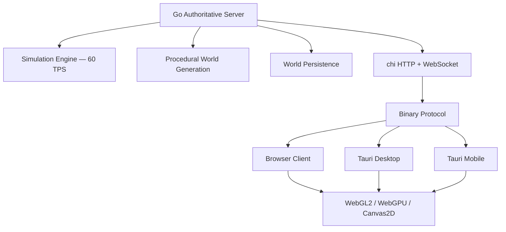

# WorldWeaver

> **One World. Many Forces.**

[](https://github.com/apil-khadka/worldweaver/actions/workflows/ci.yml)
[](LICENSE)

WorldWeaver is a real-time multiplayer emergent-world simulation built on a **server-authoritative architecture**.

A Go server continuously simulates one persistent living world — materials flow, fire spreads, plants grow. Browser, desktop, and mobile clients connect and shape it using environmental forces: Rain, Heat, Wind, Growth.

**The clients do not simulate the universe.**

> The server computes reality.
> The network transports reality.
> The GPU visualises reality.
> Tauri packages the experience.
> Modules keep every layer replaceable.

---

## Architecture



## The Idea

Expensive simulations normally run on every client device. WorldWeaver inverts this:

- The **server owns** the simulation
- Clients own only **rendering and input**
- Weak devices participate equally

## How The Simulation Works

**Cellular World** — A 2D grid of material cells (uint8 IDs) with environmental fields (temperature, moisture). Materials interact: water flows, sand falls, fire spreads, plants grow.

**Multi-rate Scheduler** — Systems run at independent rates:

| System | Rate |
|--------|------|
| Material physics | 60 Hz |
| Fire reactions | 30 Hz |
| Plant growth | 5 Hz |
| World stability | 2 Hz |
| Persistence | 0.2 Hz |

## Rendering

Runtime selects the best available backend:

```
WebGPU available? → WebGPURenderer
  WebGL2 available? → WebGL2Renderer (primary)
    fallback → Canvas2DRenderer
```

WebGL2 uploads material data as an R8UI texture. A GLSL fragment shader performs palette lookup with animated water/fire effects. Dirty chunks update via `texSubImage2D()`.

## Technology Stack

| Layer | Technology |
|-------|------------|
| Server | Go 1.22+ |
| HTTP Router | go-chi/chi v5 |
| WebSocket | coder/websocket |
| Client | TypeScript + Vite |
| Renderer | WebGL2 / WebGPU / Canvas2D |
| Desktop/Mobile | Tauri v2 |
| Container | Docker |
| CI/CD | GitHub Actions |

## Quick Start

```bash
# Clone and run
git clone https://github.com/apil-khadka/worldweaver
cd worldweaver
go run ./cmd/server
```

Open http://localhost:8080 in two browser tabs to see multiplayer.

### Docker

```bash
docker build -t worldweaver .
docker run -p 8080:8080 worldweaver
```

## Development Setup

Requirements: Go 1.22+, Node 20+

```bash
# Backend
go mod tidy
go build ./...
go test ./...

# Frontend
cd web && npm install && npm run typecheck
```

## Testing

```bash
go test ./...                    # All tests
go test ./tests/...              # Acceptance tests
go test -race ./...              # Race detector
go test -bench=. ./benchmarks/.. # Benchmarks
```

## Benchmarks

| World Size | Cells | TPS | Tick p95 | RAM |
|---|---:|---:|---:|---:|
| 512×512 | 262,144 | TBD | TBD | TBD |
| 1024×512 | 524,288 | TBD | TBD | TBD |
| 1024×1024 | 1,048,576 | TBD | TBD | TBD |

> Never pre-filled. Run `go test -bench=. ./benchmarks/...` for real numbers.

## Built With Kiro

Developed using **Kiro's spec-driven workflow** for the Ready, Spec, Ship Hackathon 2026.

### Steering (`.kiro/steering/`)
- `product.md` — vision, non-goals, product principles
- `tech.md` — architecture invariants, profiling requirements
- `structure.md` — package boundaries, dependency rules

### Specs (`.kiro/specs/`)
- `simulation-core/` — fixed timestep, material dispatch
- `material-system/` — material registry, interactions
- `multiplayer-protocol/` — WebSocket, binary encoding
- `player-powers/` — influence economy, validation
- `world-persistence/` — binary snapshots
- `performance-benchmark/` — reproducible benchmarks

### Hooks (`.kiro/hooks/`)
- `post-save-go.yaml` — gofmt + go vet
- `post-save-ts.yaml` — TypeScript typecheck
- `post-task-test.yaml` — Go tests after task completion
- `benchmark-check.yaml` — Benchmarks after performance tasks

## Project Structure

```
worldweaver/
├── cmd/server/          Server entry point
├── internal/
│   ├── world/           State arrays, chunks, fields
│   ├── simulation/      Fixed-timestep engine
│   ├── systems/         Material registry
│   ├── generation/      Terrain + climate
│   ├── game/            Player, influence, stability
│   ├── protocol/        BinaryV1 + DebugJSON encoders
│   ├── network/         chi router, WebSocket hub
│   ├── persistence/     Snapshot save/restore
│   ├── metrics/         Runtime telemetry
│   └── config/          Configuration + validation
├── web/                 TypeScript client
│   └── src/render/      WebGL2 / WebGPU / Canvas2D
├── .kiro/               Steering, specs, hooks
├── docs/decisions/      ADR-001 through ADR-009
├── tests/               Acceptance tests
└── benchmarks/          Simulation benchmarks
```

## Design Decisions

| ADR | Decision |
|-----|----------|
| [001](docs/decisions/ADR-001-server-authority.md) | Server-authoritative simulation |
| [002](docs/decisions/ADR-002-websocket-transport.md) | WebSockets over WebRTC |
| [003](docs/decisions/ADR-003-webgl2-primary-renderer.md) | WebGL2 primary renderer |
| [004](docs/decisions/ADR-004-chunked-world.md) | 64×64 chunked world |
| [005](docs/decisions/ADR-005-webgpu-optional.md) | WebGPU optional backend |
| [006](docs/decisions/ADR-006-binary-protocol.md) | Binary protocol |
| [007](docs/decisions/ADR-007-chi-router.md) | chi HTTP router |
| [008](docs/decisions/ADR-008-modular-simulation.md) | Modular simulation systems |
| [009](docs/decisions/ADR-009-multi-rate-simulation.md) | Multi-rate scheduler |

## Hackathon

**Ready, Spec, Ship Hackathon 2026** — Sponsor: Kiro

Judging: App Quality (40), Kiro Usage (20), Documentation (20), Innovation (15), Presentation (5)

## Research & Inspiration

- David Gerrells — [How fast is Go? simulating millions of particles](https://dgerrells.com/blog/how-fast-is-go-simulating-millions-of-particles-on-a-smart-tv)
- Ready, Spec, Ship Hackathon — https://codingagents.fyi/hackathon/kiro/
- Kiro documentation — https://kiro.dev/docs/

## License

MIT — see [LICENSE](LICENSE)
